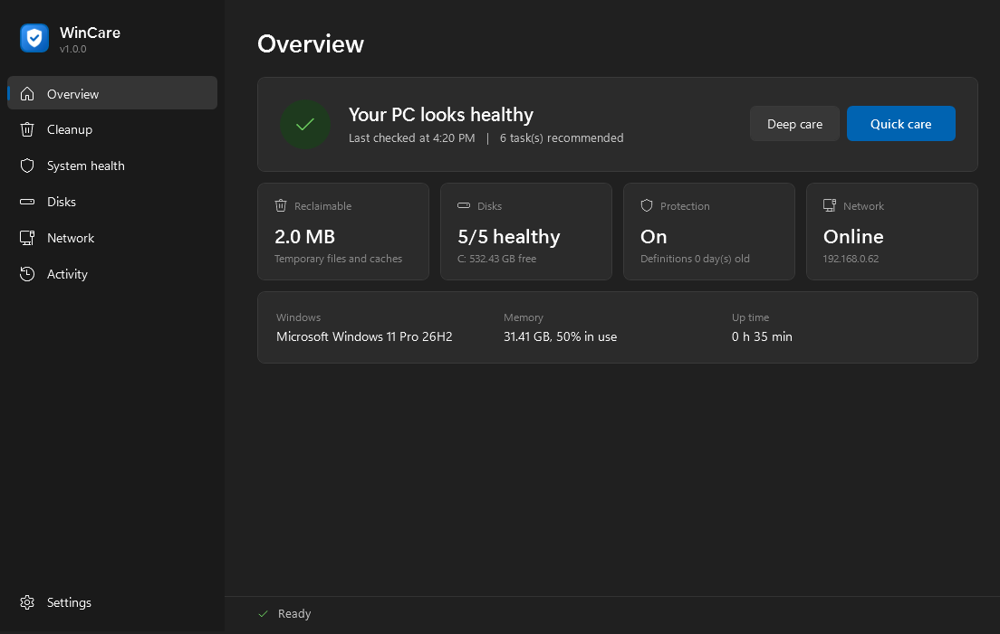
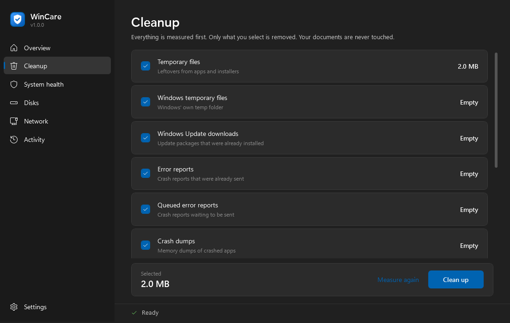
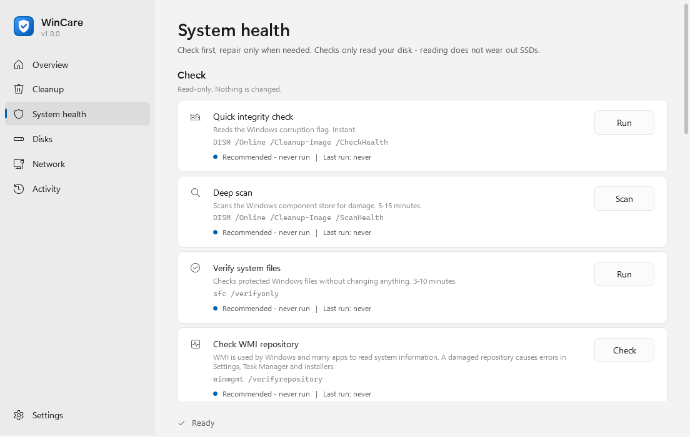

# WinCare


A clean, minimal maintenance tool for **Windows 11**. It checks your PC's health first and repairs only what needs repairing.



## Why WinCare

**Only Windows' own tools.** Every check, cleanup and repair is done by tools that already ship with Windows: `DISM`, `SFC`, `chkdsk`, `winmgmt`, `netsh`, `ipconfig`, Windows Storage cmdlets and Windows' own Delivery Optimization cleanup. WinCare installs nothing, runs no background service, uses **no third-party cleaners or drivers**, sends no data anywhere and never writes to the registry. Your Windows settings are left alone; the only exceptions are the two network resets, which run only when you choose them and say so before they start.

**The common repair commands, one click away.** The commands people usually look up and type into an elevated command prompt — `sfc /scannow`, `DISM /RestoreHealth`, `chkdsk /f`, `netsh winsock reset` and the rest — are each a button. The exact command is shown next to the button, and its real output appears on the **Activity** page, just as it would in a console.

**It tells you when a command last ran and whether you need it.** WinCare remembers when each command was last run and how it ended, and gives a short recommendation for every one of them:

- *Recommended - never run* / *Recommended - last run 40 days ago* for periodic checks
- *Not needed now* when a check ran recently and found nothing
- *Recommended - a check found a problem* for a repair, only after a check reported damage
- *Recommended - Windows was updated on ...* for removing old update files, and *Not needed - Windows did this itself* when Windows' own cleanup task already ran after the last update
- *Only needed if you have connection problems* for the network resets

So you run what is useful, not everything every time.

## Commands and when WinCare recommends them

| Command | What it does | Recommended when |
|---|---|---|
| `DISM /Online /Cleanup-Image /CheckHealth` | Reads Windows' corruption flag (instant, read-only) | Not run in the last 7 days |
| `DISM /Online /Cleanup-Image /ScanHealth` | Scans the component store for damage (read-only) | Not run in the last 30 days |
| `sfc /verifyonly` | Verifies protected system files without changing them | Not run in the last 30 days |
| `winmgmt /verifyrepository` | Checks the WMI repository | Not run in the last 90 days |
| `winget upgrade` | Lists apps with newer versions | Not run in the last 7 days |
| `DISM /Online /Cleanup-Image /RestoreHealth` | Repairs the Windows image | A check found damage |
| `sfc /scannow` | Repairs protected system files | Verification failed, or right after an image repair |
| `sfc /scanfile=<file>` | Repairs a single system file | A specific file is reported damaged |
| `winmgmt /salvagerepository` | Rebuilds an inconsistent WMI repository | The WMI check failed |
| `DISM /Online /Cleanup-Image /StartComponentCleanup` | Removes update files replaced by newer updates | Windows was updated after the last cleanup |
| Read-only file system scan (`Repair-Volume -Scan`) | Checks the system drive without a restart | Not run in the last 30 days |
| `chkdsk X: /f` · `/r` · `/f /r /x` | Repairs the file system / finds bad sectors | The file system scan found a problem |
| Drive optimization (TRIM / defrag) | TRIM for SSDs, defrag for hard disks only | Windows has not optimized the drives for 7 days |
| `ipconfig /flushdns`, adapter restart | Fixes stale DNS entries and adapters without an IP | The connection has a problem |
| `netsh winsock reset`, `netsh int ip reset` | Resets the network stack (needs a restart) | The connection has a problem |
| `bootrec` / `bcdboot` | Startup repair | Windows does not start (shown for the recovery environment) |

Run history is stored locally in `%APPDATA%\WinCare\history.json`.

## Features

- **Overview** — one glance tells you whether your PC is healthy, plus a short list of anything that needs attention
- **Quick care** (1-2 min) — safe cleanup and an instant integrity check, no questions asked
- **Deep care** (10-20 min) — adds DISM repair (only when needed), SFC, a read-only file system scan and SSD TRIM
- **Cleanup** — every location is measured first; only what you select is removed
- **System health** — check first, repair only when needed:
  `DISM /CheckHealth` `/ScanHealth` `/RestoreHealth`, `sfc /verifyonly` `/scannow` `/scanfile`,
  `winmgmt /verifyrepository` `/salvagerepository`, app update check (winget)
- **After Windows Update** — `DISM /StartComponentCleanup` removes superseded update files
- **Startup problems** — restart into the recovery environment with the right `bootrec` / `bcdboot` commands for your firmware
- **Disks** — free space, SMART health (temperature, wear, errors), read-only file system scan,
  `chkdsk /f` `/r` `/f /r /x`, media-aware optimization (TRIM for SSD, defrag for HDD only)
- **Network** — connection diagnosis, `ipconfig /flushdns`, adapter restart,
  `netsh winsock reset` and `netsh int ip reset` (opt-in, with warnings)
- **Multilingual** — English and Turkish included; adding a language is one JSON file
- Follows the Windows light/dark theme and accent color

## Safety principles

| Rule | Why |
|---|---|
| SSDs are **never** defragmented, only trimmed | Defragmentation writes data and wears flash memory |
| Read-only checks first, changes second | You always see the result before anything is modified |
| Irreversible actions always ask | Recycle Bin, image repair, component cleanup |
| Safety lock on every delete | Drive roots, Windows and profile folders can never be targets |
| No `/ResetBase`, no Prefetch deletion, no registry "cleaning" | Harmful or irreversible |
| `fsutil dirty set` is never used | It does not clear NTFS repair records and causes endless "disk error" loops |
| Network resets are never automatic | Winsock / TCP-IP resets remove VPN and custom IP settings |
| Thumbnail, icon, GPU shader, Prefetch and font caches are never cleaned | They make Windows and games faster; deleting them only forces a slow rebuild |
| Culture-invariant path checks | On Turkish Windows culture-aware matching breaks on the letter I |

## Requirements

- Windows 11 (Windows 10 21H2+ should work)
- Administrator rights
- Windows PowerShell 5.1 (built in)

## Usage

**Download:** get `WinCare-<version>.zip` from [Releases](https://github.com/borasavkar/WinCare/releases), extract it anywhere and run **`WinCare.exe`**. Windows asks for administrator rights; WinCare needs them for DISM, SFC and chkdsk.

> **SmartScreen:** the executable is not code-signed yet, so Windows may show *"Windows protected your PC"*. Choose **More info > Run anyway**. `WinCare.exe` is a tiny launcher; its full source is in [`launcher/`](launcher/) and all maintenance logic is plain PowerShell in [`src/`](src/).

**From source:** clone the repository and run `WinCare.bat`, or build the executable (see below).

```
git clone https://github.com/borasavkar/WinCare.git
```

Every command WinCare runs is shown next to its button, and its output is written to the **Activity** page.

| Cleanup | System health |
|---|---|
|  |  |

## Project layout

```
WinCare.bat               script launcher (elevation + STA)
launcher/                 source of WinCare.exe (C#) and its UAC manifest
src/Core.psm1             UI-independent engine
src/WinCare.ps1           WPF user interface
lang/*.json               translations
assets/                   icon (generated by build/New-Icon.ps1)
build/                    icon, executable and release package builders
docs/screenshots/         images used in this README
tests/                    automated checks
```

## Building

Only tools that ship with Windows are needed (the .NET Framework 4.x C# compiler):

```
powershell -NoProfile -STA -File build\New-Icon.ps1        # regenerate assets\ (optional)
powershell -NoProfile -File build\Build-Exe.ps1 -Package   # WinCare.exe + dist\WinCare-<version>.zip
powershell -NoProfile -STA -File tests\Test-WinCare.ps1    # automated checks
```

To publish a new version (sets the version everywhere, runs the checks, builds, tags, pushes and creates the GitHub release with a verified ZIP):

```
powershell -NoProfile -STA -File build\Release.ps1 -Version 1.1.0 [-NotesFile notes.md] [-DryRun]
```

The screenshots are produced by the app itself, in a read-only mode:

```
powershell -STA -File src\WinCare.ps1 -ScreenshotDir docs\screenshots -Language en -Theme dark
```

## Adding a language

1. Copy `lang/en.json` to `lang/<code>.json` (for example `de.json`).
2. Update the `_meta` block (`code`, `name`, `nativeName`, `culture`).
3. Translate the values. Keep `{0}`, `{1}` placeholders and `\n` line breaks.
4. Run `tests/Test-WinCare.ps1` — it reports missing or extra keys.

The new language appears in **Settings** automatically.

## Development notes

- `src/*.ps1` and `src/*.psm1` are kept **ASCII-only**; all text lives in `lang/`. This avoids code page problems with Windows PowerShell 5.1.
- All work runs in a background runspace; the UI thread only updates controls.
- Output of `dism`, `sfc` and `winget` is language dependent, so the code relies on exit codes and structure, never on parsing localized text.

## License

[MIT](LICENSE)
